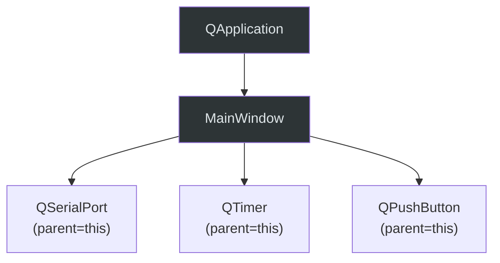

# 🏗️ Qt 项目架构设计

## 分层架构模型

```
┌─────────────────────────────────────────┐
│           UI / View Layer               │  ← *Window.ui / *Widget.cpp
│   • Qt Designer 界面 • 样式 • 动画     │     纯展示，不含业务逻辑
├─────────────────────────────────────────┤
│         Controller / Presenter          │  ← *Controller.cpp / *Window.cpp
│   • 信号槽绑定 • UI ↔ Model 协调      │     薄层，仅做"胶水"
├─────────────────────────────────────────┤
│           Service / Logic               │  ← services/*.cpp
│   • 业务规则 • 协议解析 • 数据处理     │     可独立于 UI 测试
├─────────────────────────────────────────┤
│           Data / I/O Layer              │  ← io/*.cpp / models/*.cpp
│   • 串口通信 • 文件读写 • 网络请求     │     封装底层 I/O
│   • 数据模型 • 数据库访问              │
├─────────────────────────────────────────┤
│           Qt Framework                  │
│   • QtCore • QtWidgets • QtSerialPort  │
└─────────────────────────────────────────┘
```

### 层间依赖铁律

- **只允许上层调用下层**，禁止下层 `#include` 上层头文件
- **下层通知上层**只能通过 **信号 (signal)**，不能直接调用上层方法
- **同层模块间**优先通过信号槽通信；确需直接调用时通过共享 Service 接口
- **UI 层**不直接操作 I/O，必须通过 Service 层中转

### 实际项目目录规范

```
project/
├── CMakeLists.txt
├── main.cpp
├── ui/                    # UI 层：窗口和控件
│   ├── mainwindow.h / .cpp / .ui
│   └── serialwidget.h / .cpp / .ui
├── services/              # 业务逻辑层
│   ├── serialmanager.h / .cpp
│   └── dataparser.h / .cpp
├── models/                # 数据模型
│   └── serialconfig.h
├── utils/                 # 工具函数
│   └── crc.h / .cpp
└── resources/             # 资源文件
    ├── icons/
    └── app.qrc
```

> 小型项目（单窗口、功能简单）可以**扁平化**：所有文件放在项目根目录。
> 当源文件超过 **8 个**时，必须按上述结构拆分目录。

---

## 解耦三维度

### 1. 纵向分层 — 隔离 UI 与业务

| 原则 | 做法 |
|------|------|
| UI 层不含逻辑 | 槽函数中只做：调用 Service → 更新 UI，不超过 5 行 |
| Service 层不依赖 UI | Service 类不 `#include` 任何 Widget 头文件 |
| 数据流单向 | UI → Service → I/O（下行）；I/O → signal → Service → signal → UI（上行） |

**反面案例** — 槽函数里直接操作串口 + 处理数据 + 更新UI：

```cpp
/* ❌ 禁止：UI 层直接操作 I/O 并包含业务逻辑 */
void MainWindow::onBtnClicked()
{
    QByteArray data = m_serial->readAll();
    // ... 50 行数据解析逻辑 ...
    ui->label_result->setText(parsedResult);
}
```

**正确做法** — 通过 Service 层分离：

```cpp
/* ✅ UI 层只做协调 */
void MainWindow::onDataParsed(const QString &result)
{
    ui->label_result->setText(result);
}

/* ✅ Service 层负责逻辑 */
void DataParser::processRawData(const QByteArray &raw)
{
    QString result = parse(raw);
    emit dataParsed(result);  // 信号通知上层
}
```

### 2. 横向解耦 — 模块间松耦合

通过**信号槽**实现模块间解耦，同样需要分级，不是所有情况都需要完全解耦。

#### 分级策略（防止过度设计）

| 级别 | 适用场景 | 方式 | 示例 |
|------|---------|------|------|
| **L0 直接引用** | 父子组件、紧密关联 | 直接持有指针/引用 | MainWindow 持有 Ui 指针 |
| **L1 信号槽** | 组件间通信、事件通知 | `connect(sender, signal, receiver, slot)` | 串口数据 → 界面刷新 |
| **L2 接口抽象** | 可替换实现、需要 Mock 测试 | 抽象基类 + 虚函数 | 通信接口（串口/TCP 可切换） |

**L0：绝大多数简单项目用这个就够了。** 不要为了"架构正确"给每个类都套接口。

**L1 信号槽解耦模板：**

```cpp
/* SerialManager 不知道 MainWindow 的存在 */
class SerialManager : public QObject
{
    Q_OBJECT
signals:
    void dataReceived(const QByteArray &data);
    void errorOccurred(const QString &error);
};

/* MainWindow 单方面连接 SerialManager 的信号 */
connect(m_serialMgr, &SerialManager::dataReceived,
        this, &MainWindow::onSerialDataReceived);
```

**L2 接口抽象模板（仅在确实需要替换实现时使用）：**

```cpp
/* 通信接口抽象基类 */
class ICommChannel : public QObject
{
    Q_OBJECT
public:
    virtual ~ICommChannel() = default;
    virtual bool open(const QVariantMap &config) = 0;
    virtual bool send(const QByteArray &data) = 0;
    virtual void close() = 0;

signals:
    void dataReceived(const QByteArray &data);
    void errorOccurred(const QString &error);
};

/* 串口实现 */
class SerialChannel : public ICommChannel { /* ... */ };

/* TCP 实现 */
class TcpChannel : public ICommChannel { /* ... */ };
```

### 3. 时序解耦 — 线程间通信

**Qt 项目中，跨线程通信必须使用信号槽或 QMetaObject::invokeMethod，禁止直接调用。**

```cpp
/* 跨线程信号槽：Qt 自动使用 QueuedConnection */
connect(m_workerThread, &Worker::resultReady,
        this, &MainWindow::handleResult);

/* 明确指定连接类型（推荐在跨线程时显式声明） */
connect(m_worker, &Worker::resultReady,
        this, &MainWindow::handleResult,
        Qt::QueuedConnection);
```

---

## 内存管理模型

### Qt 对象树（核心机制）



> **铁律**：通过 `new` 创建的 QObject 子类，**必须**传入 `parent`。
> 父对象析构时自动 `delete` 所有子对象，**无需手动释放**。

### 三条内存安全规则

| 规则 | 说明 | 代码 |
|------|------|------|
| **规则 1** | `new QObject` 必须传 `parent` | `new QTimer(this)` |
| **规则 2** | 不要 `delete` 有 parent 的对象 | 让对象树自动管理 |
| **规则 3** | 非 QObject 用智能指针 | `std::unique_ptr<DataParser>` |

```cpp
/* ✅ 正确：传入 parent */
m_timer = new QTimer(this);
m_serial = new QSerialPort(this);

/* ✅ 正确：非 QObject 类用智能指针 */
auto parser = std::make_unique<DataParser>();

/* ❌ 错误：new 但不传 parent，也不用智能指针 */
m_timer = new QTimer();  // 内存泄漏风险！

/* ❌ 错误：手动 delete 有 parent 的子对象 */
delete m_timer;  // parent 析构时会 double-free！
```

---

## 线程安全模型

### 何时需要线程

| 场景 | 方案 | 说明 |
|------|------|------|
| 简单异步任务 | `QTimer::singleShot` | 延迟执行，不阻塞 |
| 短暂的 CPU 密集计算 | `QtConcurrent::run` | 最简单的线程化方式 |
| 持续运行的后台任务 | `QThread` + `moveToThread` | Worker 对象模式 |
| 大量并发 I/O | `QThreadPool` | 线程池复用 |

### Worker 对象模式（推荐的 QThread 用法）

```cpp
/* ✅ 正确：Worker 对象模式 */
auto *thread = new QThread(this);
auto *worker = new HeavyWorker();

worker->moveToThread(thread);

connect(thread, &QThread::started, worker, &HeavyWorker::process);
connect(worker, &HeavyWorker::finished, thread, &QThread::quit);
connect(worker, &HeavyWorker::finished, worker, &QObject::deleteLater);
connect(thread, &QThread::finished, thread, &QObject::deleteLater);

thread->start();
```

```cpp
/* ❌ 禁止：继承 QThread 并重写 run（除非你明确知道在做什么） */
class BadThread : public QThread
{
    void run() override { /* ... */ }
};
```

---

## 过度设计的识别与避免

### 以下情况 **不要** 使用抽象接口：

| 信号 | 说明 |
|------|------|
| 只有一个实现 | 串口助手只用串口，不需要 ICommChannel |
| 不会被替换 | 单一窗口应用，不需要给 Window 套接口 |
| 模块内部使用 | 私有辅助函数不需要导出为虚函数 |
| 为了"将来可能" | YAGNI — 现在不需要就不做 |

### 以下情况 **应该** 使用抽象接口：

| 信号 | 说明 |
|------|------|
| 已有两个以上实现 | 串口 + TCP 都走通信接口 |
| 需要运行时切换 | 不同模式使用不同通信通道 |
| 需要 Mock 测试 | 脱离硬件运行单元测试 |
| 插件化扩展 | 支持动态加载模块 |

### 代码量检查

如果一个"接口抽象层"的胶水代码比实际业务逻辑还多，说明过度设计了。回退到直接调用。
