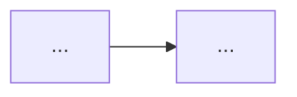
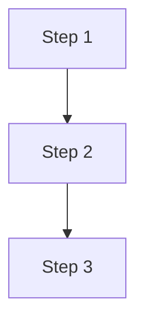

# 文档撰写规范 (doc-writer)

## 触发条件

当用户要求生成以下类型的文档时使用本 Skill：

**纠错记录**：
- "帮我记录一个 bug / 踩坑 / 错题 / 出了个问题"
- 对话结束后："把这次对话整理成踩坑记录 / 纠错文档"

**学习笔记**：
- "写学习笔记 / 整理一下我学到的 / 记录一下学习过程"
- 对话结束后："把这次对话整理成学习笔记"

**技术说明文档**：
- "写说明文档 / 操作手册 / 技术方案 / 这个东西怎么用"
- 对话结束后："把这次对话整理成说明文档"

---

## 0x01 核心原则

> **三条黄金法则，贯穿所有文档类型。**

### 法则 1：字不如表，表不如图

超过 5 行纯文字的因果描述，必须转为表格、Mermaid 图、或 ASCII 图。

| 优先形式 | 适用场景 |
|----------|----------|
| Mermaid sequenceDiagram | 时序、流程步骤、竞争条件 |
| Mermaid flowchart | 数据流向、决策分支 |
| Markdown 表格 | 对比、参数列表、环境信息 |
| diff 代码块 | 修改前后对比 |

### 法则 2：说清楚"为什么"，不只说"怎么做"

每个关键步骤后面必须有原因说明。读者需要知道为什么这样做，而不只是照着执行。

### 法则 3：可复现、可检索、可验证

- **可复现**：环境信息具体到版本号、操作系统、触发条件
- **可检索**：标题包含关键词，领域前缀明确（如 `linux -`、`STM32 -`）
- **可验证**：说明文档必须有验证方法，纠错记录必须有 Solution 代码

---

## 0x02 执行流程

### 两种触发模式

**模式 A：基于对话生成（主要场景）**

用户在技术对话结束后，要求生成文档：

```
1. 读取本次对话，自动提取关键信息
2. 判断文档类型，告知用户：
   "我理解你想生成一份「纠错记录」，将保存到「踩过的坑」目录。
    我已提取到：[列出已知信息]
    以下部分需要你补充：[列出空白项]"
3. 用户补充或确认
4. 生成完整文档并保存到对应目录
```

**模式 B：从零描述（次要场景）**

用户直接描述场景，未经过对话：

```
1. 判断文档类型，告知用户类型和保存目录
2. 按模板章节逐段引导用户描述
3. 生成完整文档并保存
```

### 输出路径映射

| 文档类型 | 保存目录 |
|----------|----------|
| 纠错记录 | `C:\Users\25076\Documents\Obsidian Vault\Doc by AI\踩过的坑\` |
| 学习笔记 | `C:\Users\25076\Documents\Obsidian Vault\Doc by AI\走过的路\` |
| 技术说明文档 | `C:\Users\25076\Documents\Obsidian Vault\Doc by AI\技术说明文档\` |

### 文件命名规范

```
{领域} - {主题简述}.md
```

示例：
- `linux - SSH Permission denied 排查.md`
- `Python - 装饰器执行顺序学习笔记.md`
- `Docker - Compose 多容器网络配置说明.md`
- `STM32 - DMA 双缓冲配置说明.md`

领域名称使用原始技术名称，首字母大写或按惯例（如 `linux`、`Git`、`STM32`、`React`）。

---

## 0x03 纠错记录模板

**适用**：程序 bug、处理问题踩的坑、写错题本
**保存至**：`踩过的坑\`

```markdown
# {领域} - {问题简述}

## 0x01 问题现场 (Context)

| 项目 | 值 |
|------|----|
| 环境/系统 |  |
| 工具版本 |  |
| 触发操作 |  |
| 发生时间 |  |

## 0x02 问题表现 (Symptom)

| 预期行为 | 实际行为 |
|----------|----------|
|  |  |

错误信息（如有）：

```text
（粘贴报错信息）
```

## 0x03 根本原因 (Root Cause)

（图优先：用 Mermaid flowchart 或 sequenceDiagram 描述因果链，纯文字不超过 3 行）

## 0x04 解决方案 (Solution)

（使用 diff 格式展示修改，或列出明确的操作步骤）

```diff
- 错误的写法 / 配置
+ 正确的写法 / 配置
```

## 0x05 原理说明 (Why It Works)

（解释为什么这个方案能解决问题，讲清楚底层原因）

## 0x06 预防建议 (Prevention)

（记录如何避免同类问题再次发生）
```

### 纠错记录自检清单

- [ ] 0x01 环境信息具体到版本号，触发步骤可复现
- [ ] 0x02 使用对比表区分预期 vs 实际，附上原始报错
- [ ] 0x03 Root Cause 有图表支撑，纯文字不超过 3 行
- [ ] 0x04 Solution 使用 diff 格式或明确步骤
- [ ] 0x05 说清楚"为什么"，不只是说"怎么做"
- [ ] 0x06 有可操作的预防措施
- [ ] 标题格式：`{领域} - {问题简述}`，关键词可被搜索命中

---

## 0x04 学习笔记模板

**适用**：技术学习记录、概念整理、新工具上手
**保存至**：`走过的路\`

```markdown
# {领域} - {学习主题}

## 0x01 学习目标 (Goal)

（一句话：要学什么 / 要达到什么效果）

## 0x02 前置知识 (Prerequisites)

（列出需要提前了解的概念，方便日后检索时判断是否适用）

- 
- 

## 0x03 核心概念 (Concepts)

（关键知识点，图表 > 纯文字）

## 0x04 学习流程 (Learning Path)

（分步骤记录学习过程，每步说明"为什么这样做"）

### Step 1：

**操作**：

**原因**：

### Step 2：

**操作**：

**原因**：

## 0x05 实践验证 (Practice)

（命令 / 代码 / 配置，附输出结果）

```bash
# 命令
```

**预期输出**：

## 0x06 常见误区 (Pitfalls)

（学习过程中容易搞错的认知坑，用对比表或具体示例说清楚）

| 误区 | 正确理解 |
|------|----------|
|  |  |

## 0x07 总结 (Summary)

（精炼的核心收获，3~5 条）

- 
- 
- 
```

### 学习笔记自检清单

- [ ] 0x01 一句话说清学习目标
- [ ] 0x02 列出了前置知识，方便检索时快速判断
- [ ] 0x03 核心概念用图表呈现，不依赖大段文字
- [ ] 0x04 每个步骤都有"为什么"的说明
- [ ] 0x05 有可运行的代码 / 命令和预期输出
- [ ] 0x06 记录了至少 1 个认知误区
- [ ] 0x07 总结精炼，不是流水账
- [ ] 标题格式：`{领域} - {主题} 学习笔记`

---

## 0x05 技术说明文档模板

**适用**：技术方案说明、操作手册、工具使用指南
**保存至**：`技术说明文档\`

**专属规范：技术视角，不用项目视角**（仅本类型文档遵守，纠错记录/学习笔记不受此约束）

- 叙述时不要写成"XX 项目里怎么做"，而要写成"这类技术场景通用的处理方式是..."，让文档脱离具体项目也能被检索、复用
- 具体的宏名、指令、接口名、状态名等技术细节该保留就保留，不要为了"去项目化"而删掉——它们是真实可复用的信息，删了反而失去价值
- 只在**叙事口吻**上换视角，不在**技术内容**上做删减

```markdown
# {领域} - {技术/方案名称}

## 0x01 概述 (Overview)

（一句话：解决什么问题 + 适用场景）

**适用场景**：
**不适用场景**：

## 0x02 涉及技术与原理 (Technology & Principles)

**核心技术栈**：

| 技术/组件 | 版本 | 作用 |
|-----------|------|------|
|  |  |  |

**工作原理**：

（用 Mermaid flowchart 描述架构或数据流）



## 0x03 前置要求 (Prerequisites)

**环境要求**：

| 项目 | 要求 |
|------|------|
| 操作系统 |  |
| 依赖工具 |  |
| 权限要求 |  |

**安装依赖**：

```bash
# 安装命令
```

## 0x04 操作流程 (Procedure)

（步骤概览，用 Mermaid flowchart 或编号列表）



## 0x05 核心步骤详解 (Step Details)

### Step 1：{步骤名称}

**操作**：

```bash
# 命令 / 配置
```

**说明**：（解释这步在做什么，为什么这样做）

### Step 2：{步骤名称}

**操作**：

**说明**：

## 0x06 验证方法 (Verification)

（如何确认操作成功，附预期输出）

```bash
# 验证命令
```

**预期结果**：

## 0x07 常见问题 (FAQ)

| 问题 | 原因 | 解决方法 |
|------|------|----------|
|  |  |  |
```

### 技术说明文档自检清单

- [ ] 叙述视角是"这类技术场景通用的处理方式"，不是"XX 项目里怎么做"；具体宏名/指令/接口名等技术细节未被删减
- [ ] 0x01 一句话说清解决的问题和适用场景
- [ ] 0x02 技术栈列表完整，有原理图
- [ ] 0x03 前置要求具体到版本号和权限
- [ ] 0x04 操作流程有概览图，步骤清晰
- [ ] 0x05 核心步骤每步都有"为什么"
- [ ] 0x06 有具体的验证命令和预期输出
- [ ] 0x07 记录了常见踩坑问题
- [ ] 标题格式：`{领域} - {名称}`
