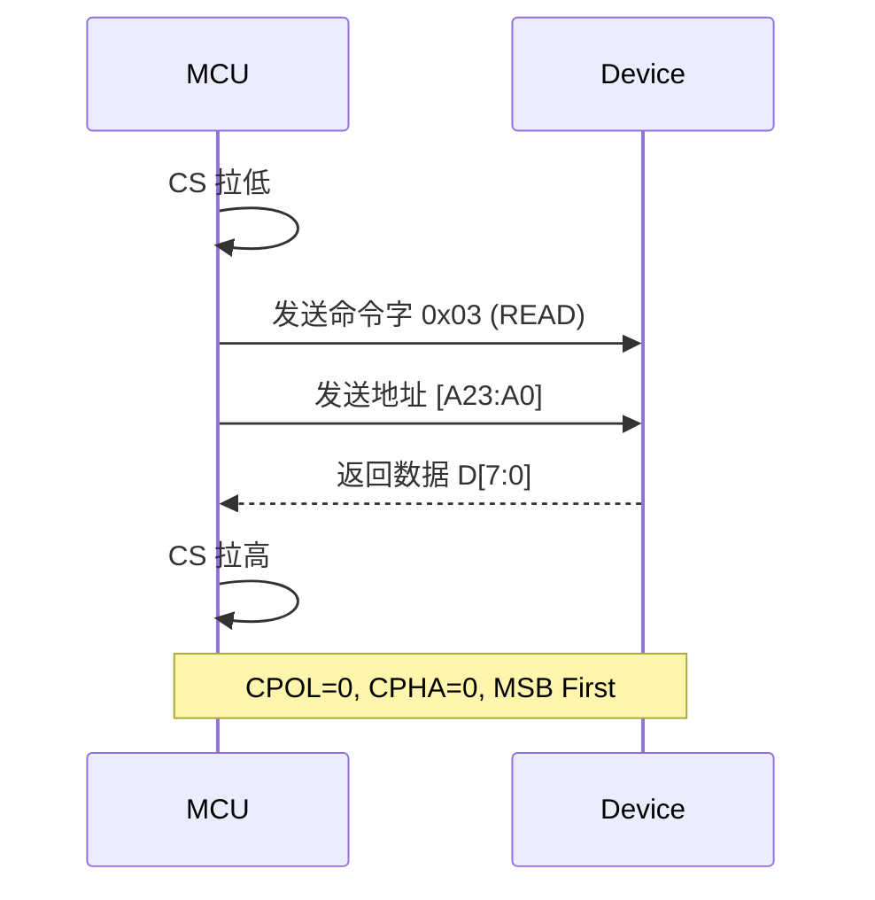
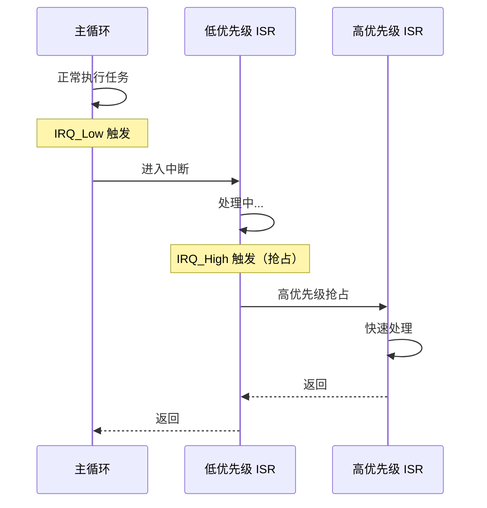
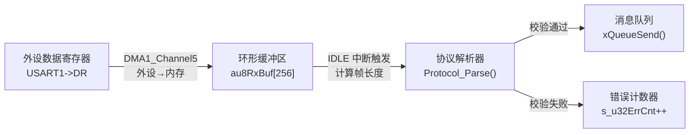

# 嵌入式工程 Markdown 文档编写规范

## 触发条件

当用户要求编写**嵌入式工程技术文档**时使用本 Skill，包括但不限于：
- 模块设计文档、驱动接口说明
- 外设通信协议分析（SPI/I2C/UART/CAN 等）
- 内存布局与 Flash 分区说明
- 算法原理与数学模型推导

**不适用于**：
- 调试记录、踩坑总结、HardFault 分析 → 使用 `embedded-pitfall` Skill
- 纯代码注释 → 遵循 `code-style.md`
- Git 提交消息 → 使用 `git-commit` Skill
- 项目管理文档（README/CHANGELOG）

---

## 0x01 核心原则

> **三条黄金法则，贯穿所有技术文档。**

### 法则 1：字不如表，表不如图

能用时序图、内存映射图表达的，坚决不用大段文字。

| **图优先** | 形式不限：Mermaid 图、ASCII 树形图、表格均可，按表达效果选型 | 超过 5 行纯文字描述因果链 |

```
? "SPI 通信时，主机先拉低 CS，然后在 SCLK 上升沿发送 MOSI 数据,
    同时在下降沿采样 MISO 数据，传输完成后拉高 CS..."

? 直接画 Mermaid 时序图（见 0x03 章节模板）
```

### 法则 2：Talk is cheap, show me the code

关键的寄存器配置、指针操作、位域操作必须附带**精简**代码片段。

```
? "将定时器的 PSC 寄存器设置为合适的分频值以获得所需频率"

? TIM2->PSC = 72 - 1;   /* 72MHz / 72 = 1MHz 计数频率 */
   TIM2->ARR = 1000 - 1; /* 1MHz / 1000 = 1kHz 溢出频率 */
```

### 法则 3：剥开抽象看底层

重点讲透三件事：
1. **数据流向**：如 DMA 搬运路径、缓冲区生命周期
2. **中断上下文隔离**：ISR 与主循环之间的数据交互边界
3. **内存分配边界**：栈 vs 堆 vs 静态区，谁分配谁释放

---

## 0x02 标准文档结构模板

> **所有嵌入式技术文档统一使用以下四段式结构。**

```markdown
# 模块名称

## 0x01 概述 (Overview)

一句话说明：本模块解决什么问题。
硬件依赖：MCU型号 + 外设（如 STM32F103 + SPI1 + W25Q128）。
关键指标：波特率、刷新率、精度等核心参数。

## 0x02 架构与数据流 (Architecture & Data Flow)

模块交互关系图（Mermaid 框图）。
数据完整生命周期：从采集 → 处理 → 存储/上屏。
中断/DMA 与主循环的交互边界标注。

## 0x03 核心实现 (Implementation)

关键算法与数学公式（LaTeX 渲染）。
核心寄存器配置（附精简代码）。
状态机设计（Mermaid stateDiagram）。

## 0x04 避坑与 Debug 指南 (Gotchas & Debugging)

按 `embedded-pitfall` Skill 的四段式模板逐条记录。
HardFault 追踪方法。
时序冲突/总线死锁等实战案例。
```

### 自检清单

写完文档后逐项核查：

- [ ] 0x01 是否一句话说清了模块职责和硬件依赖？
- [ ] 0x02 是否有**至少一张**架构图或数据流图？
- [ ] 0x03 涉及寄存器操作的地方是否全部附带了代码片段？
- [ ] 0x04 已知的坑是否全部使用标准模板记录？
- [ ] 全文是否存在超过 5 行的**纯文字描述**可以替换为图表？

---

## 0x03 底层逻辑与内存流向的表达技法

### 3.1 内存映射图 (Memory Map)

使用 Markdown 表格清晰描述 Flash/RAM 的段分配。

**模板**：

| 起始地址 | 结束地址 | 大小 | 区域 | 说明 |
|----------|----------|------|------|------|
| `0x0800_0000` | `0x0800_7FFF` | 32KB | Bootloader | IAP 引导程序 |
| `0x0800_8000` | `0x0803_FFFF` | 224KB | APP 区 | 用户应用程序 |
| `0x0804_0000` | `0x0807_FFFF` | 256KB | OTA 暂存区 | 固件升级缓存 |

**外部 Flash 寻址示例**（如 GB2312 字库在 W25Q128 中的布局）：

| 偏移地址 | 大小 | 内容 | 寻址公式 |
|----------|------|------|----------|
| `0x00_0000` | 256KB | 12×12 字库 | `addr = (qu - 0xA1) × 94 × 24 + (wei - 0xA1) × 24` |
| `0x04_0000` | 512KB | 16×16 字库 | `addr = base + (qu - 0xA1) × 94 × 32 + (wei - 0xA1) × 32` |
| `0x0C_0000` | 1MB | 24×24 字库 | `addr = base + (qu - 0xA1) × 94 × 72 + (wei - 0xA1) × 72` |

### 3.2 时序与通信协议图

使用 Mermaid `sequenceDiagram` 描述外设通信流程。

**SPI 读取寄存器时序模板**：



**中断抢占流程模板**：



### 3.3 位域 (Bitfield) 变更对比

展示操作前后寄存器特定位的变化，**而不是贴出整本数据手册**。

**模板**：

| Bit | 名称 | 操作前 | 操作后 | 说明 |
|-----|------|--------|--------|------|
| [15:8] | BRR | `0x00` | `0x27` | 波特率分频：72MHz/115200 ≈ 39 |
| [3] | TE | `0` | `1` | 发送使能 |
| [2] | RE | `0` | `1` | 接收使能 |
| [1] | RWU | `0` | `0` | 未变更 |

对应代码：

```c
/* USART1 配置: 115200-8-N-1 */
USART1->BRR = 0x0027;          /* 波特率分频值 */
USART1->CR1 |= (1 << 3)        /* TE: 发送使能 */
             | (1 << 2);       /* RE: 接收使能 */
```

### 3.4 DMA 数据流向图

使用 Mermaid `flowchart` 描述 DMA 搬运路径。

**模板**：



---

## 0x04 公式与算法的规范化呈现

### 4.1 行内公式

简单变量和短表达式使用**单美元符号**：

```markdown
系统时钟频率 $f_{osc} = 72\text{MHz}$，经过 AHB 分频后 $f_{AHB} = f_{osc} / \text{AHB\_DIV}$。
```

### 4.2 独立公式

复杂推导使用**双美元符号**，独占一行：

**定时器溢出时间**：

```markdown
$$T_{overflow} = \frac{(ARR + 1) \times (PSC + 1)}{f_{clk}}$$
```

**波特率计算**（USART）：

```markdown
$$Baud = \frac{f_{clk}}{16 \times USARTDIV}$$
```

**ADC 一阶 IIR 数字低通滤波**：

```markdown
$$y[n] = \alpha \cdot x[n] + (1 - \alpha) \cdot y[n-1], \quad \alpha = \frac{T_s}{T_s + RC}$$
```

**PID 离散化**：

```markdown
$$u[k] = K_p \cdot e[k] + K_i \cdot \sum_{i=0}^{k} e[i] \cdot T_s + K_d \cdot \frac{e[k] - e[k-1]}{T_s}$$
```

### 4.3 公式与代码的对照

公式后面**必须**紧跟对应的 C 实现代码，让读者能直接映射数学到代码：

```markdown
$$y[n] = \alpha \cdot x[n] + (1 - \alpha) \cdot y[n-1]$$

对应实现：

    ```c
    #define FILTER_ALPHA  0.1f  /* α = Ts/(Ts+RC), 截止频率约 1.6Hz */

    float Filter_IIR_LowPass(float fNewSample)
    {
        static float s_fLastOutput = 0.0f;

        s_fLastOutput = FILTER_ALPHA * fNewSample
                      + (1.0f - FILTER_ALPHA) * s_fLastOutput;
        return s_fLastOutput;
    }
    ```
```

---

## 自检清单

编写文档**完成后**，逐项核查：

### 结构完整性
- [ ] 包含 0x01 ~ 0x04 四个标准章节
- [ ] 0x01 概述是否一句话说清了模块职责
- [ ] 0x02 是否至少包含一张架构图或数据流图（Mermaid）

### 视觉表达
- [ ] 全文不存在超过 5 行的纯文字段落可以替换为图/表
- [ ] 内存布局使用了表格而非纯文字描述
- [ ] 通信时序使用了 Mermaid sequenceDiagram
- [ ] 寄存器操作使用了位域对比表

### 代码与公式
- [ ] 所有寄存器配置都附带了精简代码片段
- [ ] 数学公式使用 LaTeX 渲染（`$...$` 或 `$$...$$`）
- [ ] 独立公式后紧跟对应的 C 实现代码
